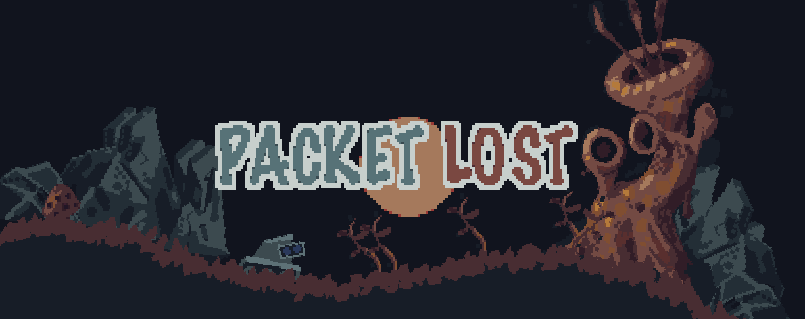

  

# Packet Lost

This is the code and assets repository for our (me, Luka and Axi) Raylib 5K jam submission, ["Packet Lost"](https://itch.io/jam/raylib-5k-gamejam/rate/1374384)! (Latest version with bugfixes playable (right in your browser!) at: [https://nikki93.github.io/raylib-5k/](https://nikki93.github.io/raylib-5k/))

It uses my Go->C++ transpiler, called [Gx](https://github.com/nikki93/gx), along with my own little framework that includes an entity system, a scene editor and seriaization. The framework doesn't wrap Raylib at all--Raylib is used directly. The jam entry doesn't use the serialization system much since the world is procedurally generated, but the editor came in handy during development to debug and explore the resulting scene. Interesting things to look at:

- [game/behaviors.gx.go](game/behaviors.gx.go): This file lists the components that can be attached to an entity, along with some other data structures. This basically shows the structure of the game's state.
- [game/game.gx.go](game/game.gx.go): This composes the entirety of the game's runtime logic, over the above data. It's all in one file because we sped through this in the jam--usually I would split it up into files meant for each aspect of the game. No header files needed since Gx's module system (coming from Go) just makes things work.

The game doesn't use any out-of-the-box physics engine, but it does use [cute c2](https://github.com/RandyGaul/cute_headers/blob/master/cute_c2.h) for collisions. The response to these collisions is [done directly in game code](https://github.com/nikki93/raylib-5k/blob/57bc80d123c32d867a10f1d3fc2657da3feaa733/game/game.gx.go?ts=2#L870-L914). This allows for some degree of control and flexibility in game design, and also is nicer than having to deal with the stateful / retained "create / destroy / set propreties" APIs of most physics engines. The game code owns its data and it all just lives in the components. The tradeoff of using a physics engine can definitely make sense if a game needs dynamic rotations, multiple constraints (including stacking) etc. I would've used a spatial hash (`cpBBTree` from Chipmunk is a good one) but on profiling I found that collision didn't come up at all, so that wasn't much of a priority.

The files under [core/](core/) make up the engine. This is the code I started with from previous projects (everything under 'game/' was newly written for this particular game for the jam). [core/entity.hh](core/entity.hh) is the entity system implementation, which could be cool to look at if you're curious how the data is stored. [core/read_write.hh](core/read_write.hh) implements the serialization system. Bindings of the C and C++ things to Gx live in the directories under core. For example, [core/rl/generated.gx.go](core/rl/generated.gx.go) includes automatically generated bindings to most of Raylib's core API.

All the game art and sound go in [assets/](assets/). 

I'll be adding much more information here soon! Part of the motivation for doing the jam was to have a resulting open source example like this that uses Gx. But the jam was tiring and now I should probably rest for a bit so... Will get to that in a little while... 😅
